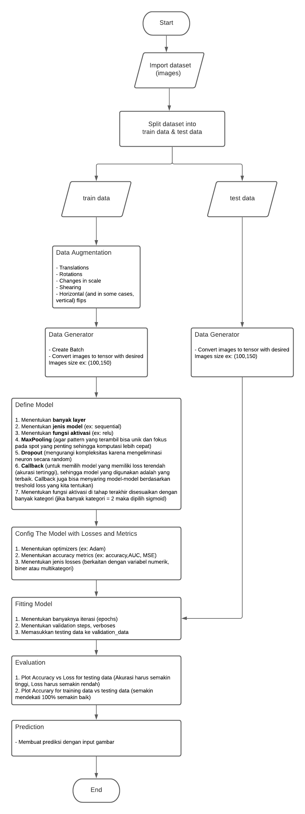

# CONVOLUTIONAL NEURAL NETWORK (CNN)

## ISTILAH
Beberapa hal yang perlu dipahami di dalam CNN adalah
1. Konvolusi
adalah istilah matematis yang berarti mengaplikasikan sebuah fungsi pada output fungsi lain secara berulang. Di bidanga citra, konvolusi digunakan untuk mengekstrak fitur dari citra. Konvolusi akan menghasilkan transformasi linier dari data input sesuai dengan informasi spasial pada data.

2. Filter
Merupakan suatu matriks yang akan menjadi pengali untuk blok-blok matriks objek. Filter di inisiasi dengan nilai tertentu. Filter ini akan diupdate terus dalam learning.
3. Kernel_size

4. receptive field
5. activation map
Merupakan kumpulan gambar-gambar baru yang dihasilkan dari proses pemberian filter yang dilakukan berulangkali dengan nilai filter yang berbeda-beda.

6. feature identifiers
7. loss function
8. Convolution
9. Dense
10. Maxpooling
11. Convolutional Layer
12. padding
13. Sequential
14. pool_size
15. Flatten
16. Fully Connected

## KONSEP DASAR
CNN merupakan salah satu jenis ANN yang terinspirasi jaringan syaraf manusia yang biasa digunakan untuk mendeteksi dan mengenali objek (primary visual cortex). Oleh karena itu CNN sangat populer digunakan dalam deteksi dan pengenalan objek.

Manusia dan hewan melihat objek dengan mengamati pattern-pattern berupa lengkungan, garis lurus, lingkaran, kotak, oval, persegi panjang dan lainnya.

pattern-pattern tersebutlah yang akan menjadi parameter apakah dua objek mirip atau tidak. Jika dua gambar memiliki pattern yang sama, maka kedua gambar bisa dikatakan sama/identik.

## LANGKAH KERJA
1. Neuron menerima input suatu objek/gambar
2. Objek/gambar akan diterjemahkan dalam bentuk matriks (sebut matriks A)
3. Buat suatu filter berupa matriks (sebut matriks P) yang akan menjadi pengali matriks A
4. Setiap blok pada matriks A, kalikan dengan matriks P. (ukuran matriks A = ukuran matriks B)
5. Hasil perkalian di tahap (4) akan disimpan di suatu matriks baru (sebut matriks B). Ukuran matriks B akan menjadi lebih kecil dari matriks A. 
6. Matriks B inilah yang menjadi layer convolutional (Feature Map 1).
7. Setiap blok pada matriks B, kalikan dengan matriks P dan simpan di matriks C. (Feature Map 2)
8. Setiap blok pada matriks C, kalikan dengan matriks P dan simpan di matriks D. (Feature Map 3)
9. Banyaknya layer kita tentukan sendiri. Anggap kita pakai 3 layer.
10. Pada layer terdalam yaitu ke 3, lakukan Max Pooling yaitu mereduce ukuran gambar dengan cara mengambil nilai tertinggi dari blok matriks D.
11. Feature yang dihasilkan tiap gambar akan di match dengan gambar-gambar lain. Jika dua objek memiliki feature yang sama/identik/hampir sama dengan label, maka dia akan diberi label sesuai kategori tersebut.
12. Lakukan Evaluasi Model 
 
## Flowchart

## REFFERENCE
1. https://adeshpande3.github.io/A-Beginner%27s-Guide-To-Understanding-Convolutional-Neural-Networks/
2. https://towardsdatascience.com/a-beginners-guide-to-convolutional-neural-networks-cnns-14649dbddce8
3. https://www.tensorflow.org/tutorials/images/cnn
4. https://www.kaggle.com/cdeotte/how-to-choose-cnn-architecture-mnist
