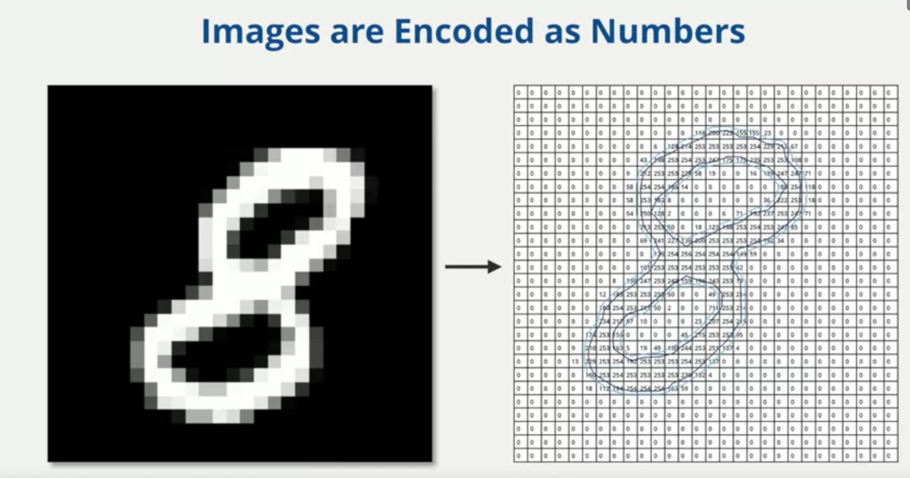

# 🤖 Deep Learning - Panduan Lengkap

Deep learning adalah cabang dari machine learning yang menggunakan **jaringan saraf tiruan (neural networks)** dengan banyak lapisan (deep). Pendekatan ini memungkinkan model untuk menangkap pola kompleks dan non-linier dari data, seperti dalam pengolahan gambar, suara, dan teks.

---

## 📘 Daftar Isi

1. [Artificial Neural Network (ANN)](#1-artificial-neural-network-ann)
2. [Convolutional Neural Network (CNN)](#2-convolutional-neural-network-cnn)
3. [Recurrent Neural Network (RNN)](#3-recurrent-neural-network-rnn)
4. [LSTM dan GRU](#4-long-term-short-term-memory-lstmgru-networks)
5. [Deep Belief Networks (DBN)](#5-deep-belief-networks-dbn)
6. [Deep Stacking Networks (DSN)](#6-deep-stacking-networks-dsn)
7. [Model Lain dalam Deep Learning](#7-model-lain)

---

## 1. 🧠 Artificial Neural Network (ANN)

ANN terinspirasi dari cara kerja otak manusia. ANN terdiri dari neuron buatan yang memproses data input menjadi output melalui bobot, bias, dan fungsi aktivasi.

### 🔹 Komponen ANN

- **Input Layer**: Representasi numerik dari data (misalnya gambar diubah ke dalam bentuk matriks).
- **Hidden Layer**: Tempat berlangsungnya proses belajar.
- **Output Layer**: Hasil akhir dari model (klasifikasi/regresi).
- **Bobot & Bias**: Parameter yang dipelajari oleh model.
- **Fungsi Aktivasi**: Mengatur keluaran neuron dan memetakan pola non-linier.

### 🔹 Perceptron vs Neural Network
- **Perceptron**: Model dengan satu neuron (single-layer).
- **Neural Network (MLP)**: Model dengan banyak neuron dan hidden layer.

### 🔹 Fungsi Aktivasi Umum
- Sigmoid
- ReLU
- Leaky ReLU
- Tanh
- ELU

---

## 2. 🖼️ Convolutional Neural Network (CNN)

CNN adalah arsitektur ANN khusus untuk pemrosesan gambar. CNN bekerja dengan cara mengekstrak fitur lokal menggunakan filter (kernel).

### 🔹 Komponen Utama CNN

| Komponen           | Fungsi                                                                 |
|--------------------|------------------------------------------------------------------------|
| **Convolutional Layer** | Menggunakan filter untuk mengekstrak fitur dari gambar.         |
| **Pooling Layer**       | Mengurangi ukuran data sambil mempertahankan fitur penting.     |
| **Flatten Layer**       | Mengubah hasil pooling ke dalam bentuk vektor 1D.               |
| **Fully Connected Layer** | Layer klasik seperti ANN untuk klasifikasi akhir.             |

### 🔹 Jenis Pooling
- **Max Pooling**: Mengambil nilai maksimum.
- **Average Pooling**: Mengambil nilai rata-rata.

📌 Cocok digunakan untuk: **Image Classification, Object Detection, Face Recognition**

---

## 3. 🔁 Recurrent Neural Network (RNN)

RNN digunakan untuk data **berurutan** seperti teks dan sinyal waktu. RNN memiliki *loop* dalam arsitekturnya sehingga dapat mengingat informasi dari waktu sebelumnya.

📌 Cocok untuk: **Natural Language Processing (NLP), Time Series Prediction**

---

## 4. ⏳ Long Term Short Term Memory (LSTM)/GRU Networks

Merupakan pengembangan dari RNN untuk mengatasi **masalah long-term dependencies**.

| Model | Keunggulan |
|-------|------------|
| **LSTM** | Memiliki sel memori internal, mampu menyimpan informasi jangka panjang. |
| **GRU** | Versi ringan dari LSTM, lebih cepat dengan performa sebanding. |

---

## 5. 🔐 Deep Belief Networks (DBN)

DBN terdiri dari beberapa layer **Restricted Boltzmann Machines (RBM)**. DBN digunakan untuk **dimensionality reduction**, **feature extraction**, dan **image classification**.

📌 Mirip dengan Autoencoder, namun memiliki arsitektur pembelajaran bertingkat.

---

## 6. 🧱 Deep Stacking Networks (DSN)

Model deep learning modular di mana beberapa neural network kecil (sub-nets) distack secara paralel. Cocok untuk dataset besar yang memerlukan pembelajaran bertahap.

---

## 7. 🌐 Model Lain

| Model | Deskripsi Singkat |
|-------|-------------------|
| **RCNN** | Deteksi objek berbasis region. |
| **GoogleNet / Inception** | Struktur modular untuk efisiensi dan akurasi tinggi. |
| **AlexNet** | Pemenang ImageNet, CNN awal dengan ReLU dan Dropout. |
| **ResNet** | Deep learning dengan residual connection (skip connection). |
| **ResNeXt** | Pengembangan dari ResNet dengan cardinality. |
| **SegNet** | Segmentasi citra berbasis encoder-decoder. |
| **GAN** | Arsitektur dua jaringan (generator & discriminator) untuk menghasilkan data. |
| **SqueezeNet** | CNN ringan dengan akurasi tinggi. |
| **YOLO** | Deteksi objek real-time satu kali lihat. |

---

## 🧪 Ilustrasi & Visualisasi

### 🔹 Image to Matrix

### 🔹 CNN Flowchart
/images/flowchart.png)

---

## Image to Matriks

## CNN Flowchart
/images/flowchart.png)

## 📘 Referensi
- Ian Goodfellow, Yoshua Bengio, Aaron Courville. *Deep Learning*.
- [CS231n - Stanford University](https://cs231n.github.io/)
- [Deep Learning Book](https://www.deeplearningbook.org/)
- [Kaggle Learn: Deep Learning](https://www.kaggle.com/learn/deep-learning)

