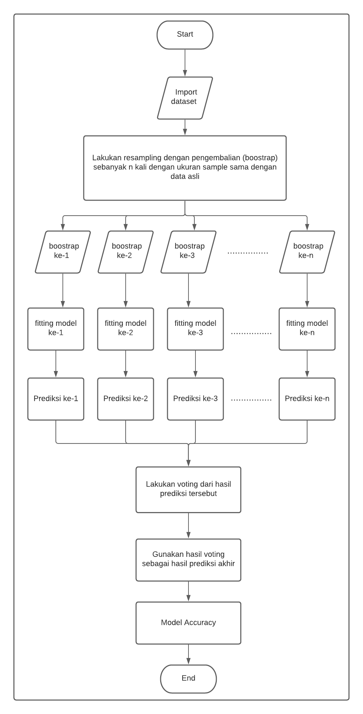

# Bagging

## Definition
- Bagging (Boostrap aggregating) dikenal sebagai salah satu metode yang paling simpel dalam arching (adaptive reweighting and combining), sebuah terminologi umum yang mengacu pada penggunaan kembali atau pemilihan data untuk meningkatkan akurasi klasifikasi (Sewell, 2018).

- Bagging dapat digunakan untuk berbagai model dengan tujuan klasifikasi maupun regresi seperti Decision Tree, Naive Bayes, ANN, SVM. Namun secara umum, bagging banyak digunakan untuk model yang tidak stabil seperti decision tree dan ANN. tidak stabil artinya adanya sedikit perubahan pada latih akan berpengaruh besar pada model pembelajaran yang dihasilkan.

- Cara kerja metode bagging ini dengan cara penggabungan sejumlah r model yang dilatih menggunakan sejumlah r himpunan data latih yang dibangkitkan secara acak mengggunakan metode bootstrap masing-masing model tersebut saling independen. 

- Metode boostrap atau random with replacement adalah pembangkitan subhimpunan data latih menggunakan sampling acak dengan distribusi seragam dimana data yang sudah terpilih secara acak bisa dikembalikan ke data sumber sehingga dapat terpilih kembali.
- Metode bagging akan bekerja jika setiap model tunggal bersifat tidak stabil, namun saling melengkapi. Penggabungan beberapa model tersebut mampu mereduksi kesalahan prediksi.

- Pada umumnya, 50 model independen sudah cukup untuk menghasilkan model gabungan yang memberikan kesalahan relatih rendah (Breiman 1996a). Penambahan jumlah model tunggl hingga 100 model tidak mampu lagi mereduksi kesalahan (Breiman 1996a).

## Flowchart

## Refference
- Suyanto. 2018. Machine Learning Tingkat Dasar dan Lanjut. Informatika. Bandung.