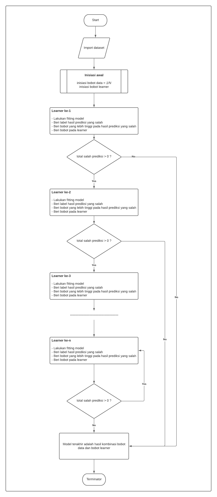

# Boosting

## Definition
- Sesuai dengan namanya yaitu boosting, tujuannya adalah **mem-boosting data yang sebelumnya salah prediksi**. Oleh karena itu, resampling yang digunakan pada boosting adalah tidak secara acak, namun diberikan peluang yang berbeda. Data yang salah prediksi dari hasil sebelumnya mempunyai peluang terpilihnya semakin tinggi. Sehingga pada akhirnya akan didapatkan model yang bagus untuk semua data (tidak hanya di beberapa data saja)
- The term ‘Boosting’ refers to a family of algorithms which converts weak learner to strong learners.

## How the algorithm works:

- Step 1: The base algorithm reads the data and assigns equal weight to each sample observation.

- Step 2: False predictions made by the base learner are identified. In the next iteration, these false predictions are assigned to the next base learner with a higher weightage on these incorrect predictions.

- Step 3: Repeat step 2 until the algorithm can correctly classify the output.

## Algorithms List
- Adaptive Boosting (AdaBoost)
- Gradient Boosting
- Xtreme Gradient Boosting (XGBoost)
- Light Gradient Boosting 

## Flowchart

## Refference
- Suyanto. 2018. Machine Learning Tingkat Dasar dan Lanjut. Informatika. Bandung.
- https://www.edureka.co/blog/boosting-machine-learning/
- https://towardsdatascience.com/what-is-boosting-in-machine-learning-2244aa196682