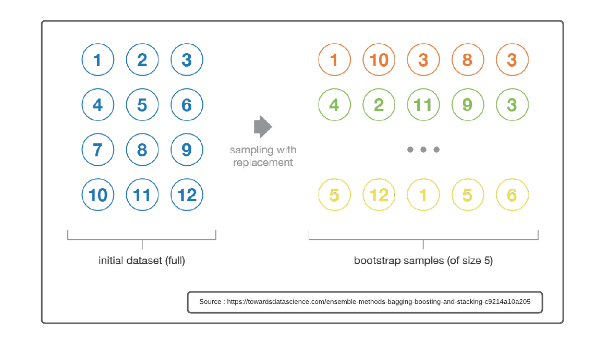
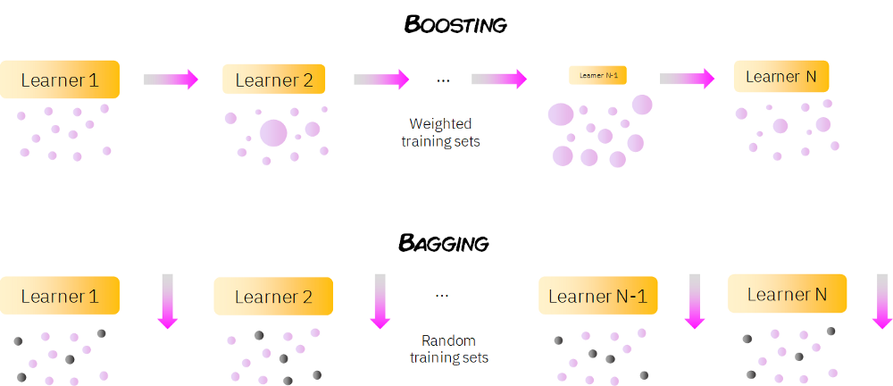

# Ensemble Learning

## Definition
Ensemble learning bisa dibilang sebagai pembelajaran menggunakan sistem demokrasi. Hal ini karena hasil prediksi menggunakan voting dari beberapa metode. Secara arti, jika kita lihat pengertian ensemble adalah

> a group of items viewed as a whole rather than individually

Konsep dasar penting yang patut dipahami dalam Ensemble learning adalah **Boostrap**. Boostrap merupakan resamling with replacement yang artinya data yang terpilih bisa terpilih kembali, seperti ilustrasi di bawah ini

Ensemble learning dengan konsep majority voting hanya bekerja (memberikan akurasi maksimum) jika dan hanya jika 
1. Setiap saling model saling independen, yang dilatih dengan himpunan data yang saling independen.
2. Masing-masing model memiliki akurasi leihh dari 50%

Teknik penggabungan sejumlah model ini dapat menggunakan
1. Bagging (random sampling with replacement)
2. Boosting (weighted based on accuray)
3. Random Forest (several decision tree)
4. Stacking

## Bagging vs Boosting

## Refference
- Suyanto. 2018. Machine Learning Tingkat Dasar dan Lanjut. Informatika. Bandung.
- https://towardsdatascience.com/ensemble-methods-bagging-boosting-and-stacking-c9214a10a205
- https://www.edureka.co/blog/boosting-machine-learning/