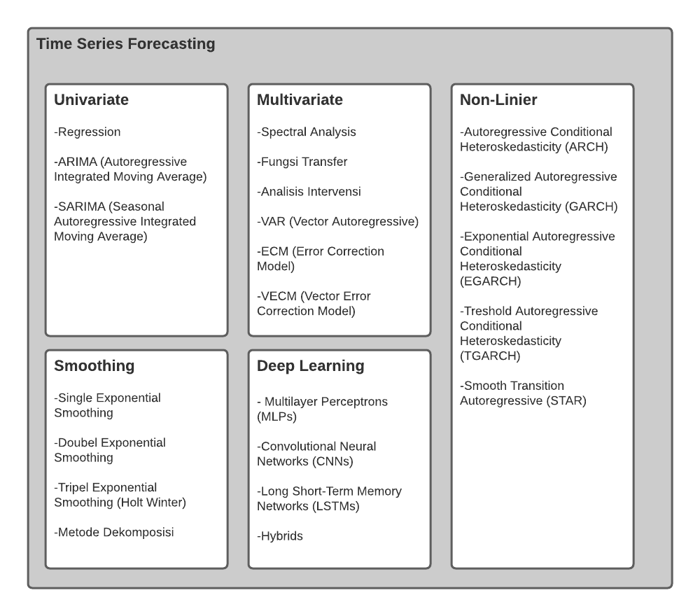

# Forecasting
Data time series merupakan data yang dikumpulkan menurut dimensi waktu (day, month, or year). Metode analisis yang digunakan di data time series berbeda dengan data cross section.

## Taxonomy

## REFFERENCE
- https://www.sciencedirect.com/topics/computer-science/supervised-classification