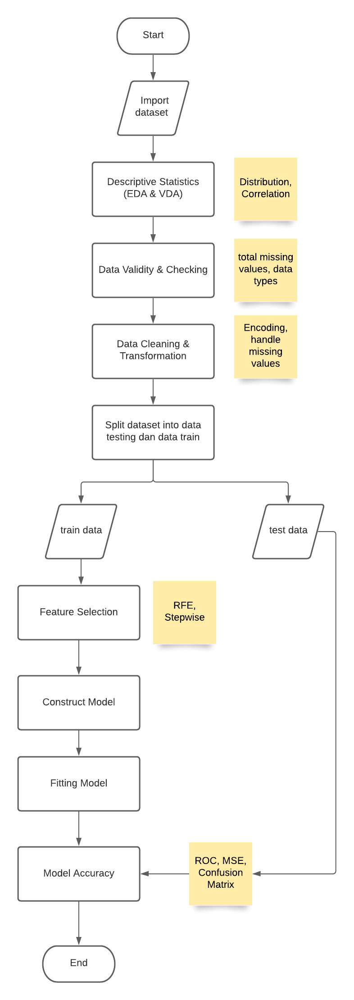
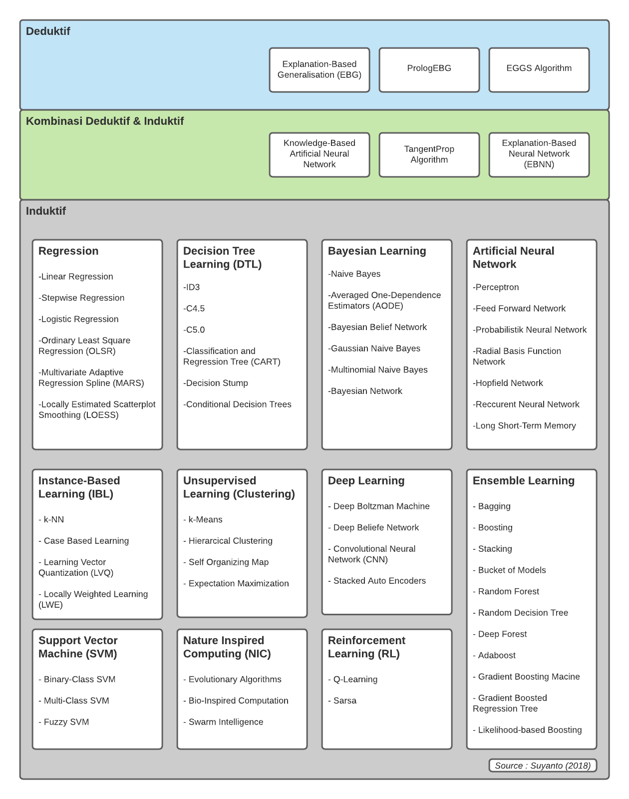

### ARTIFICIAL INTELLIGENCE (AI)
AI adalah simulasi dari kecerdasan manusia yang diproses atau disimulasikan oleh mesin atau sistem komputer. AI merupakan bagian dari ilmu computation science atau sAIns komputasi. AI juga dapat dikatakan merupakan pengembangan sistem komputer yang mampu mengerjakan tugas yang melibatkan proses berpikir, seperti reasoning, planning, learning, dan self-correction.

### Cabang AI
Berdasarkan cara kerja, teknologi AI biasa dibagi menjadi dua kategori, yaitu
1. **rule-based AI** <br/>
Rule-based AI bekerja berdasarkan aturan. Komputer mengandalkan “aturan–aturan” yang sudah ditetapkan atau diprogram oleh manusia untuk memetakan apa “hasil atau jawaban” yang dikeluarkan oleh komputer (atau bisa disebut output) apabila  ada informasi yang dimasukkan ke dalam sistem (bisa disebut input).

2. **Machine learning** <br/>
komputer tidak mengandalkan aturan–aturan yang diprogram oleh manusia, namun komputer mengolah data yang dimasukkan oleh manusia untuk mencari pola- pola tertentu yang muncul dalam data tersebut. Pola–pola inilah yang “dipelajari” oleh komputer dan menjadi acuan saat sistem AI digunakan. 

### Cabang Machine Learning
1. Supervised Learning (Learn Through Label Data)
2. Unsupersived Learning (Doesnt Learn Through Label Data)
3. Reinforcement Learning (Learn Through Consequence of Action/Interact with Environment)
4. Ensemble Learning (Democratic System)
5. Instance-Based Learning 
6. Deep Learning (Machine Learning with many layers)
7. Bayesian Learning
8. Nature Inspired Computing
9. Artificial Neural Network


Berdasarkan kegunaannya, AI dibagi menjadi 
1. Computer vision <br/>
adalah cabang teknologi AI yang memiliki fokus untuk mengolah gambar dari foto, video, atau langsung dari kamera. 

2. Natural Language Processing (NLP) <br/>
kemampuan meniru manusia dalam berbicara dan berbahasa (text sebagi input).

3. Speech Recognition <br/>
kemampuan meniru manusia dalam berbicara dan berbahasa (suara sebagai input). Contoh: Siri, Alexa, Google Assistant. 

4. Robotics <br/>
memiliki fokus untuk membangun mesin fisik untuk menjalankan berbagai fungsi yang sebelumnya membutuhkan keterampilan tangan manusia.

## Summary Code

Beberapa Algoritma yang bisa digunakan
```
from sklearn.model_selection import StratifiedKFold, cross_val_score,GridSearchCV
from sklearn.linear_model import LinearRegression
from sklearn.metrics import accuracy_score
from sklearn.tree import DecisionTreeClassifier
from sklearn.neighbors import KNeighborsClassifier
from sklearn.naive_bayes import GaussianNB
from sklearn.svm import SVC
from sklearn.ensemble import RandomForestClassifier
from sklearn.linear_model import LogisticRegression
from xgboost import XGBRFClassifier
```

Splitting dataset into training dataset & testing dataset
```
from sklearn.model_selection import train_test_split
X_train, X_test, y_train, y_test = train_test_split(X, y, test_size=0.3, random_state=0)
```

Construct & Fit Model
```
cart_fit = DecisionTreeClassifier().fit(X_train, y_train)
knn_fit = KNeighborsClassifier().fit(X_train, y_train)
naive_fit = GaussianNB().fit(X_train, y_train)
svm_fit = SVC(probability=True).fit(X_train, y_train)
randomforest_fit = RandomForestClassifier().fit(X_train, y_train)
gb_fit = GradientBoostingClassifier().fit(X_train,y_train)
xgboost_fit = XGBRFClassifier().fit(X_train,y_train)
```

Evaluasi Model
```
from sklearn.metrics import mean_squared_error
print ('RMSE: ', mean_squared_error(y_test, predictions))
akurasi=cross_val_score(model, Xtrain, y_train,cv=cv)

def getROC_Curve(fit):
    from sklearn.metrics import roc_auc_score
    from sklearn.metrics import roc_curve
    
    roc_auc = roc_auc_score(y_test, fit.predict(X_test))
    fpr, tpr, thresholds = roc_curve(y_test, fit.predict_proba(X_test)[:,1])
    plt.figure()
    plt.plot(fpr, tpr, label=' '+str(fit)+' (area = %0.2f)' % roc_auc)
    plt.plot([0, 1], [0, 1],'r--')
    plt.xlim([0.0, 1.0])
    plt.ylim([0.0, 1.05])
    plt.xlabel('False Positive Rate')
    plt.ylabel('True Positive Rate')
    plt.title('Receiver operating characteristic')
    plt.legend(loc="lower right")
    
    return plt.show()

getROC_Curve(xgboost_fit)
```

## Flowchart


## Taksonomi


## Refference

- Suyanto. 2018. Machine Learning Tingkat Dasar dan Lanjut. Informatika. Bandung.

