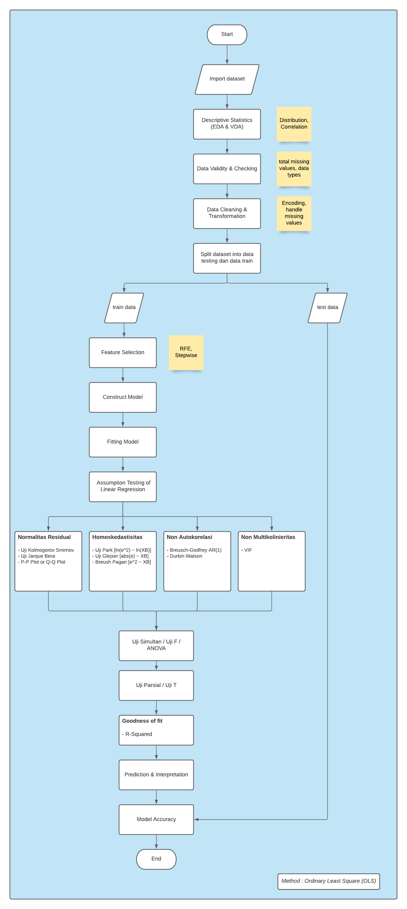

# ANALISIS REGRESI LINIER 
Analisis regresi merupakan analisis data yang bertujuan untuk memodelkan hubungan antara variabel dependent dan variabel independent. Jika skala pengukuran variabel dependent adalah nominal atau ordinal, maka dia akan termasuk ke analisis regresi logistik . Model regresi linier dapat digambarkan sebagai berikut

`
y = a * X1 + b * X2 + c * X3 + error
`

Tujuan dari analisis ini adalah menemukan konstanta a,b, dan c sedemikian hingga variabel error sekecil-kecilnya. Ada banyak metode yang dapat digunakan untuk mendapatkan konstanta tersebut. Diataranya adalah OLS (Ordinary Least Square) dan Maximum Likelihood. Sekarang, pertanyaannya adalah penduga manakah yang paling baik ?

Menurut teorema Gauss-Markov, Penduga OLS (Ordinary Least Square) atau juga disebut MKT (Metode Kuadrat Terkecil) akan menjadi penduga terbaik diantara semua penduga ketika dia memenuhi beberapa asumsi, yaitu
1. **Hubungan antara variabel respon dan variabel prediktor adalah linier dalam parameter.**  
Maksudnya adalah model regresi yang memiliki bentuk fungsional parameter yang linier atau masih dapat dilinierkan
2. **Variabel prediktor adalah variabel non stokastik yang nilainya tetap.**  
Jika ternyata stokastik, maka variabel tersebut harus bebas terhadap sisaan. artinya nilai pengamatan pada saat t tidak dipengaruhi oleh periode yang lainnya (asumsi ini sulit dipenuhi pada data deret waktu)
3. **Nilai harapan** (expected value) atau rata-rata  sisaan 𝜀𝑖 **adalah nol** atau 𝐸(𝜀𝑖 |𝑋)  =  0  
Asumsi ini berimplikasi bahwa tidak ada bias spesifikasi dalam model pada suatu analisis empiris;
4. Varians dari sisaan 𝜀𝑖 adalah sama (**homoskedastisitas**) atau 𝑉𝑎𝑟(𝜀𝑖|𝑋) = 𝜎
5. Tidak ada korelasi serial (**non autokorelasi**) antar sisaan atau ğ¶ğ‘œğ‘£(𝜀𝑖, ğœ€ğ‘—|ğ‘‹ğ‘–, ğ‘‹ğ‘—) = 0 untuk 𑖠≠ ğ‘—.  
Artinya kesalahan pengukuran terjadi bukan karena pengaruh kesalahankesalahan pengukuran yang sebelumnya
6. **Sisaan 𝜀𝑖 berdistribusi normal atau 𝜀𝑖~𝑁(0, 𝜎2)**
7. Pada analisis regresi linier berganda, tidak boleh terdapat hubungan yang erat antar variabel prediktor (**non multikolinieritas**).

Namun, dalam analisis regresi berganda biasanya pengujian hanya dilakukan terhadap empat asumsi saja yaitu 
1. **Normalitas sisaan**  
Sisaan harus berdistribusi normal. Teknik pengujian yang dapat dipakai adalah Kolomogorov-Smirnov dan Jarque-Bera.
2. **Non-multikolinieritas**  
Tidak boleh terjadi hubungan antar variabel independen. Teknik pengujian yang dapat dipakai adalah VIF.
3. **Homogenanitas ragam sisaan**  
Ragam sisaan harus konstan. Teknik pengujian yang dapat dipakai adalah Uji Breush Pagan, Ujin Park, Uji Glejser, dan Uji White.
4. **Non-autokorelasi**  
Tidak boleh terjadi korelasi antar sisaan. Teknik pengujian yang dapat dipakai adalah Uji Durbin Watson

# Flowchart

