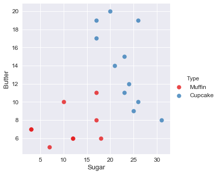
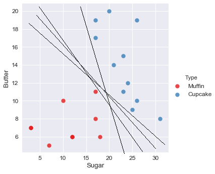
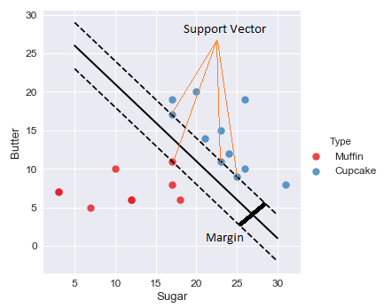

### Support Vector Machine

Support Vector Machine (SVM) diperkenalkan oleh Vapnik pada tahun 1992 sebagai teknik klasifikasi yang efisien untuk masalah nonlinier. SVM berbeda dengan teknik klasifikasi di era 1980-an, seperti decision tree dan ANN, yang secara konsep seringkali terjebak pada optimum lokal. Penerapan metode ini bisa digunakan untuk kasus face detection, pengkategorian text, pengelompokan gambar dan di bidang bioninformatika.

Misalkan kita mempunyai scatter plot data observasi seperti di bawah ini. Jika ada suatu data baru masuk, Bagaimana cara kita membedakan data tersebut termasuk kategori Muffin atau Cupcake ?

Cara paling mudah untuk membedakan suatu data baru masuk dalam kelas Muffin atau Cupcake adalah dengan menarik suatu garis lurus yang seolah-olah akan menjadi pemisah antara kedua kelas tersebut. Akan ada banyak kemungkinan garis yang memisahkan kedua kelas tersebut seperti yang ditunjukkan gambar di bawah ini. Garis manakah yang paling tepat ?

Inilah ide dibalik metode Support Vector Machine yaitu menemukan suatu garis (a.k.a hyperplane) yang akan menjadi pemisah terbaik untuk kategori/kelas tersebut. Pemisah yang terbaik adalah yang memisahkan kedua kelas selebar mungkin/sejauh mungkin. Sehingga prinsip kerja metode SVM adalah menemukan hyperplane sedemikian hingga margin antara kedua kelas adalah yang terbesar (find the widest range), seperti yang ditunjukkan gambar di bawah ini

Margin merupakan jarak antara dua kelas (dihitung dari titik terluar masing-masing kelas). Garis putus-putus menunjukkan batas terluar masing masing kelas. Garis lurus yang berada di tengah-tengah garis putus-putus tersebut adalah garis pemisah terbaik yang membagi kedua kelas sedemikian hingga margin kedua kelas adalah maximum. Titik terluar dari masing-masing kelas disebut dengan support vector

## Terminologi
1. Fitur (Feature)
    -  Variabel input yang digunakan untuk memprediksi. 
    - Contoh: tinggi, berat, umur → fitur dari orang.

2. Label / Target
    - Kelas atau output yang ingin diprediksi.
    - Contoh: +1 untuk “Lulus”, -1 untuk “Tidak Lulus”.

3. Hyperplane
    - Garis (2D) atau bidang (3D) yang memisahkan dua kelas dalam data.
    - Tujuan SVM: menemukan hyperplane optimal yang memisahkan kelas.
    - 2D (2 fitur) → hyperplane = garis.
    - 3D (3 fitur) → hyperplane = bidang datar.
    - nD (n fitur) → hyperplane adalah permukaan berdimensi (n-1).

4. Margin
    - Jarak antara hyperplane dengan titik terdekat dari masing-masing kelas.
    - SVM berusaha memaksimalkan margin → maximum margin classifier.
    - SVM tidak sekadar cari garis pemisah sembarangan. Dia mencari hyperplane yang membuat jarak antar kelas sejauh mungkin (maximum margin).
    - Dengan hyperplane + margin:
        - Model lebih tahan terhadap noise.
        - Hasil klasifikasi lebih bagus untuk data baru.
        - Tidak mudah overfitting seperti kalau kita pilih garis asal.

5. Support Vectors
    - Titik-titik data terdekat dengan hyperplane yang menentukan posisi hyperplane.
    - Tanpa support vectors, hyperplane akan bergeser.
    - Intinya: titik penting yang “menopang” hyperplane.

6. Linear vs Non-linear SVM
    - Linear SVM → data bisa dipisahkan dengan garis lurus / bidang.
    - Non-linear SVM → data tidak bisa dipisahkan garis lurus, butuh transformasi ke ruang lebih tinggi.

7. Kernel
    - Fungsi yang mengubah data ke dimensi lebih tinggi agar bisa dipisahkan.
    - Jenis umum:
        - Linear → garis biasa
        - Polynomial → bentuk kurva
        - RBF (Gaussian) → memetakan ke ruang dimensi tinggi
        - Sigmoid → mirip aktivasi neural network
8. C (Regularization Parameter)
    - Menentukan toleransi SVM terhadap kesalahan:
    - Nilai tinggi → hyperplane mencoba benar-benar memisahkan semua titik (risk overfitting)
    - Nilai rendah → lebih fleksibel, bisa toleran kesalahan (risk underfitting)

9. Soft Margin vs Hard Margin
    - Hard margin → hyperplane tidak boleh salah klasifikasi titik manapun (jarang dipakai, sensitif terhadap outlier)
    - Soft margin → hyperplane boleh salah klasifikasi beberapa titik, tapi tetap maksimalkan margin.

10. Slack Variable (ξ / xi)
    - Digunakan di soft margin SVM untuk mengukur seberapa jauh titik melanggar margin.
    - Semakin kecil ξ → titik dekat margin / hyperplane.

11. Decision Function
    - Fungsi yang digunakan SVM untuk menentukan kelas prediksi dari titik baru:

## Reference
- materi langkap : https://www.canva.com/design/DAGxvG_5I-g/6YhRZqzxxCwchqBTvgZEcw/edit?utm_content=DAGxvG_5I-g&utm_campaign=designshare&utm_medium=link2&utm_source=sharebutton 

