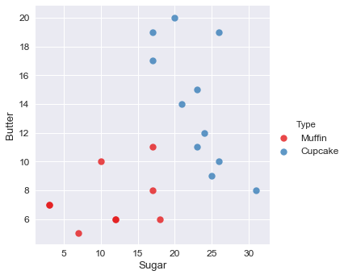
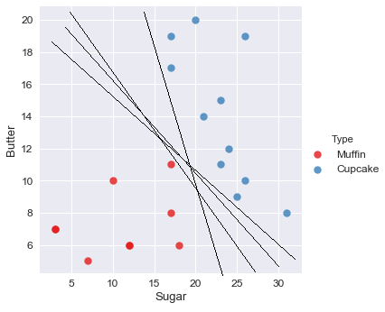
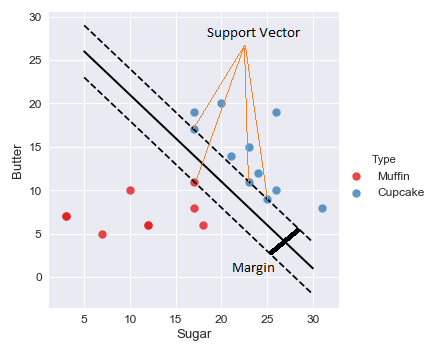

### Support Vector Machine

Support Vector Machine (SVM) diperkenalkan oleh Vapnik pada tahun 1992 sebagai teknik klasifikasi yang efisien untuk masalah nonlinier. SVM berbeda dengan teknik klasifikasi di era 1980-an, seperti decision tree dan ANN, yang secara konsep seringkali terjebak pada optimum lokal. Penerapan metode ini bisa digunakan untuk kasus face detection, pengkategorian text, pengelompokan gambar dan di bidang bioninformatika.

Misalkan kita mempunyai scatter plot data observasi seperti di bawah ini. Jika ada suatu data baru masuk, Bagaimana cara kita membedakan data tersebut termasuk kategori Muffin atau Cupcake ?

Cara paling mudah untuk membedakan suatu data baru masuk dalam kelas Muffin atau Cupcake adalah dengan menarik suatu garis lurus yang seolah-olah akan menjadi pemisah antara kedua kelas tersebut. Akan ada banyak kemungkinan garis yang memisahkan kedua kelas tersebut seperti yang ditunjukkan gambar di bawah ini. Garis manakah yang paling tepat ?

Inilah ide dibalik metode Support Vector Machine yaitu menemukan suatu garis (a.k.a hyperplane) yang akan menjadi pemisah terbaik untuk kategori/kelas tersebut. Pemisah yang terbaik adalah yang memisahkan kedua kelas selebar mungkin/sejauh mungkin. Sehingga prinsip kerja metode SVM adalah menemukan hyperplane sedemikian hingga margin antara kedua kelas adalah yang terbesar (find the widest range), seperti yang ditunjukkan gambar di bawah ini

Margin merupakan jarak antara dua kelas (dihitung dari titik terluar masing-masing kelas). Garis putus-putus menunjukkan batas terluar masing masing kelas. Garis lurus yang berada di tengah-tengah garis putus-putus tersebut adalah garis pemisah terbaik yang membagi kedua kelas sedemikian hingga margin kedua kelas adalah maximum. Titik terluar dari masing-masing kelas disebut dengan support vector

